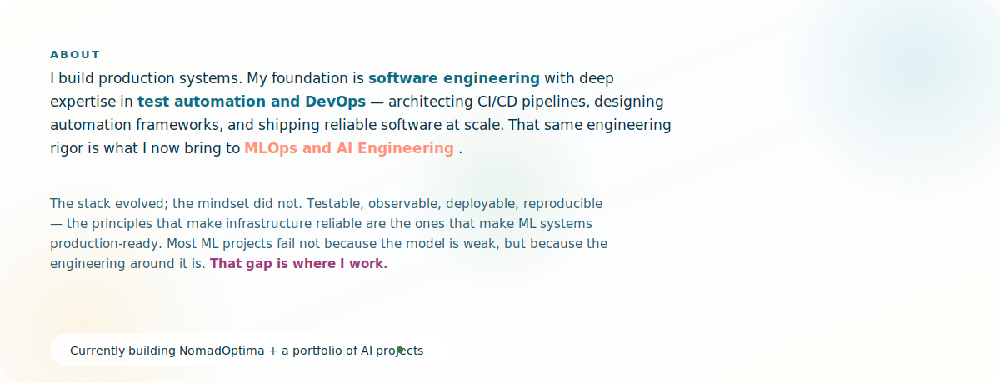
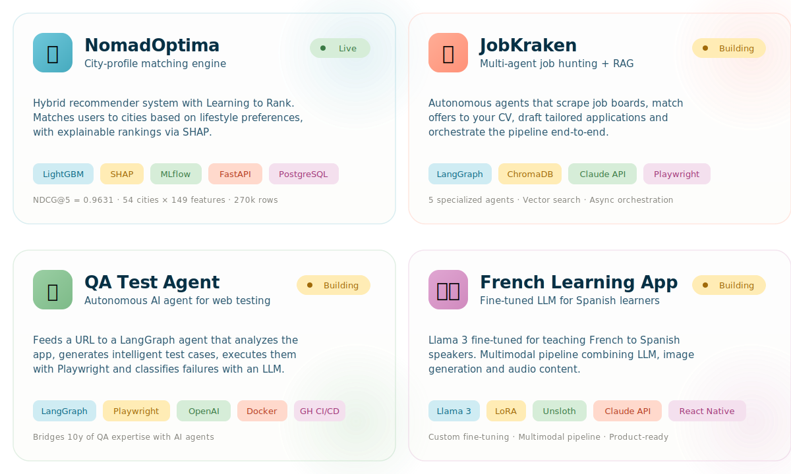
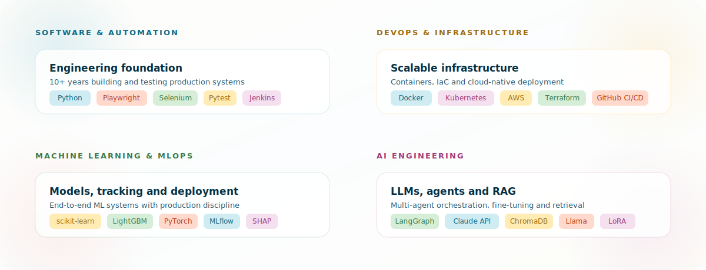
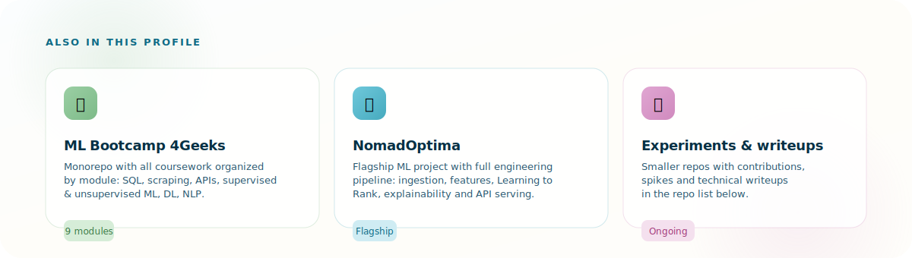
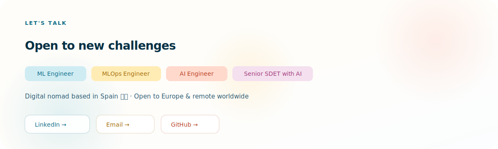
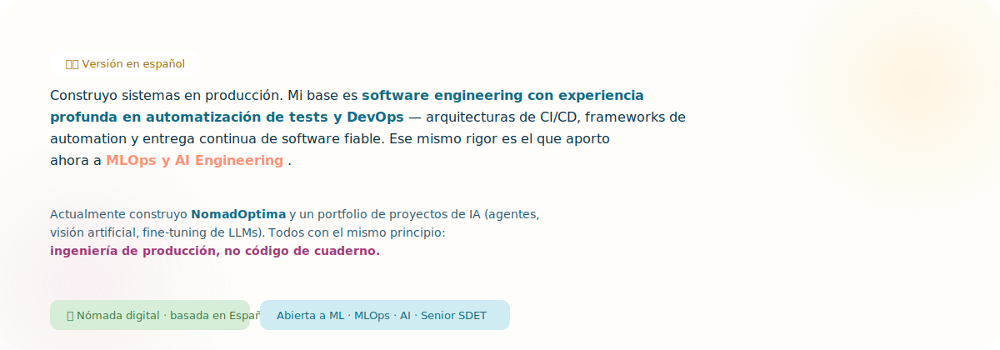

  

 

  

 

  

  <a href="https://github.com/cdiazcapado/nomadoptima"><b>NomadOptima →</b></a> &nbsp;·&nbsp;
  <a href="https://github.com/cdiazcapado/jobkraken"><b>JobKraken →</b></a> &nbsp;·&nbsp;
  <a href="https://github.com/cdiazcapado/qa-test-agent"><b>QA Test Agent →</b></a> &nbsp;·&nbsp;
  <a href="https://github.com/cdiazcapado/french-learning-app"><b>French App →</b></a>

 

  

 

  

  <a href="https://github.com/cdiazcapado/ml-bootcamp-4geeks"><b>ML Bootcamp 4Geeks →</b></a> &nbsp;·&nbsp;
  <a href="https://github.com/cdiazcapado?tab=repositories"><b>All repositories →</b></a>

 

  

  <a href="https://www.linkedin.com/in/cristinadiazcapado/"><b>LinkedIn</b></a> &nbsp;·&nbsp;
  <a href="mailto:cdcapadowork@gmail.com"><b>cdcapadowork@gmail.com</b></a> &nbsp;·&nbsp;
  <a href="https://github.com/cdiazcapado"><b>GitHub</b></a>

 

  

 
 
